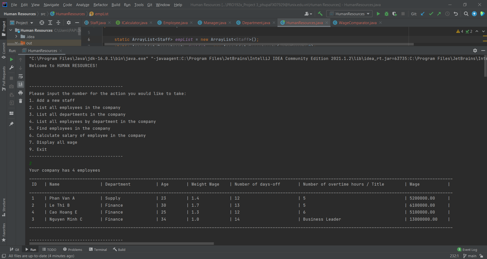

# pro192x_2.1-a_vn-java-oop-basics-humanresources

 This folder contains my submission to the assignment `Human Resources` in the course PRO192x_2.1-A_VN (Object-Oriented Programming with Java), a part of the path Software Engineering provided by FUNiX.

## About the project

- The project simulates a simple program to manage human resources. And to fulfill this, the project covers Java basics and OOP (the UI is just simple print-outs on console): expressions with variables of different types in Java, printing out in console, loops in Java, Scanner.in to get user input, handle with value-return methods, comparator to sort collections as well as use formatter to print out with specified styles in console.

- **Keyword**: _Java basics, collections, object-oriented programming, OOP, comparator, printf, formatter_.

## Functional description
The project contains files:
- `Employee.java` - definition of employees
- `Manager.java` - definition of managers
- `Department.java` - definition of departments
- `HumanResources.java` - the main flow of program
- `ICalculator.java` - interface with methods calculating wage

Some functional features include:
- Display a list of all employees in the company
- Display a list of all departments in the company
- Display all employees group by department
- Add a new employee (an ordinary staff or a manager with tittle)
- Find a employee with ID or name
- Display payrolls of all employees (in ascending order of descending order)

## Demo

The demo video can be seen via: https://www.youtube.com/watch?v=rkD5hd46kDA

## Further enhancement
- Add UI with JavaFX or Java Swing for better user interaction.
